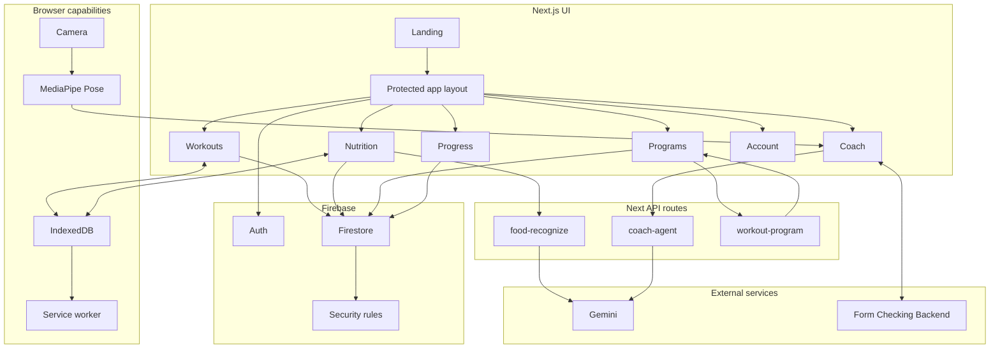
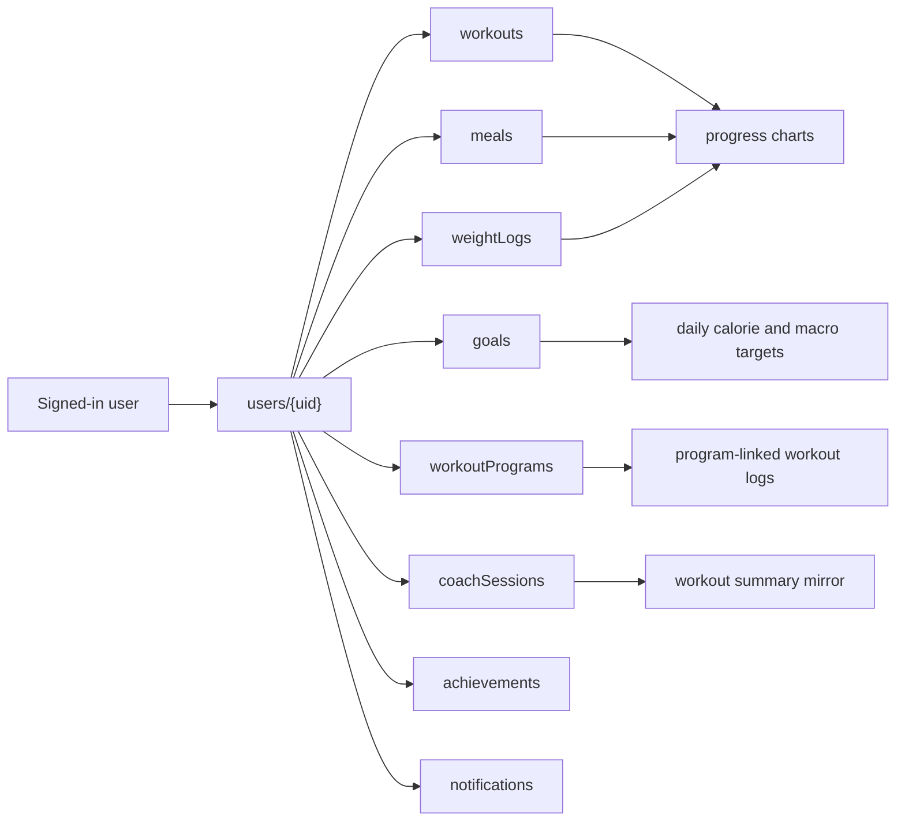
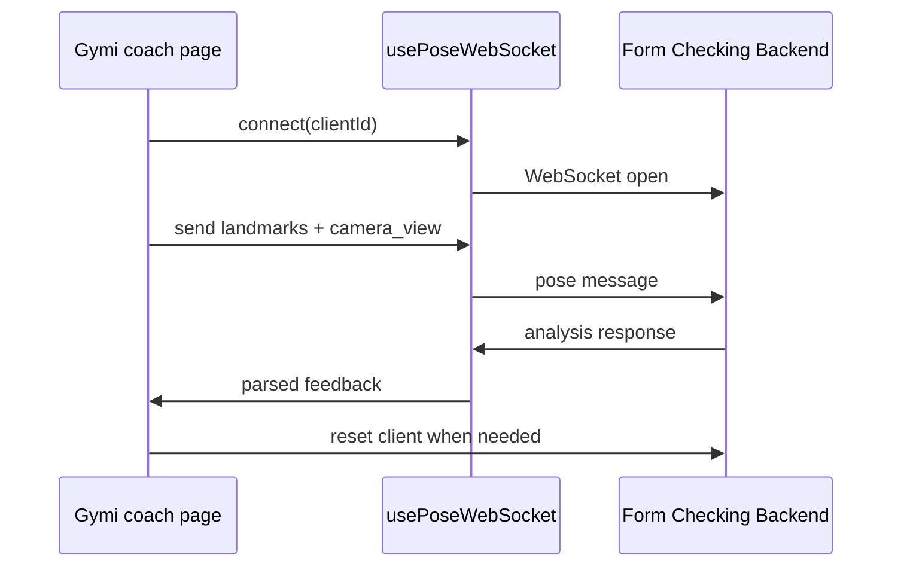

# Gymi Development Plan

This is the living engineering plan for the current Gymi frontend. It replaces older planning notes that predated the current program, nutrition, offline, and form-coach pipelines.

## Current Status

| Area | Status | Notes |
| --- | --- | --- |
| Next.js app shell | Shipped | Protected app routes are wrapped by `ProtectedRoute`, `ErrorBoundary`, `ToastProvider`, and shared layout components. |
| Firebase Auth | Shipped | Auth gates the app shell and redirects logged-out users to `/`. |
| Firestore services | Shipped | User-owned services exist for workouts, meals, goals, weight logs, programs, coach sessions, achievements, and notifications. |
| Workout logging | Shipped | CRUD, filters, view modes, offline queueing, and optional program-session linkage. |
| Nutrition logging | Shipped | CRUD, daily targets, templates, food scanner, and offline queueing. |
| Program generation | Shipped | Deterministic generator with validation, templates, equipment rules, active/archive/complete flows. |
| Form coach | Shipped integration | Browser MediaPipe plus backend WebSocket integration. Depends on separate backend availability. |
| Coach assistant | Shipped | `/api/coach-agent` uses Gemini with live and recent-user context. |
| PWA/offline | Shipped baseline | Service worker caches routes/assets; IndexedDB queues common offline mutations. |
| Tests | Active | Current test command is `npm test`. |
| Production hardening | Ongoing | Needs continued E2E and deployed-environment verification. |

## Architecture Baseline



## Development Principles

- Keep data ownership explicit: app pages should use service modules rather than raw Firestore calls wherever practical.
- Keep the form-coach boundary stable: browser extracts landmarks, backend interprets movement.
- Keep AI features optional enough that the main app still works if Gemini is unavailable.
- Prefer deterministic behavior for program generation and critical tracking workflows.
- Add tests around rules, transformations, and user-facing regressions before broad UI polish.
- Maintain these docs whenever routes, services, environment variables, or backend contracts change.

## Current Data Flow



## Roadmap

### Phase 1: Stabilize The Demo Core

Goal: make the existing product dependable for exhibition and review.

- Keep `/coach` reliable against backend cold starts and transient WebSocket failures.
- Add clear UI states for connecting, connected, disconnected, and backend-unavailable.
- Verify coach-session saving and workout mirroring after each backend contract change.
- Keep `/api/food-recognize/health` visible from Account for quick scanner diagnosis.
- Maintain deterministic program generation tests.

Acceptance checks:

```powershell
npm test
npm run build
```

Manual checks:

- Sign in.
- Create workout.
- Create meal.
- Generate or activate program.
- Connect `/coach` to backend.
- Save coach session.

### Phase 2: Improve Training Value

Goal: make the app feel more like a real training companion.

- Add a stronger program adherence view.
- Show missed, completed, and upcoming program sessions.
- Improve exercise substitutions based on equipment and user limitations.
- Add session notes and perceived-exertion tracking.
- Expand progress charts with weekly volume and consistency summaries.

Suggested tests:

- Program status transitions.
- Program-session workout linkage.
- Adherence calculations.
- Progress chart data transformations.

### Phase 3: Improve Nutrition Value

Goal: make food logging useful beyond one-off estimates.

- Add daily and weekly nutrition trends.
- Improve meal-template reuse.
- Add clearer confidence or uncertainty copy for scanned meals.
- Add edit-before-save flows for every scanner result.
- Add tests for Gemini parser fallbacks and malformed model output.

Suggested tests:

- Food API validation for bad mime types, oversized images, no-food responses, and malformed JSON.
- Meal target calculations when only calorie goals are present.
- Offline meal create/update/delete replay.

### Phase 4: Production Hardening

Goal: reduce demo-only assumptions.

- Add E2E coverage for auth, workouts, nutrition, programs, and coach page connection states.
- Add deployment-specific smoke checks for Firebase and backend URLs.
- Add observability for API failures without leaking secrets.
- Review service worker cache versioning before each deployment.
- Revisit Firebase Storage only when a real media-upload feature is designed.

## Testing And Verification

Run from the `gymi` repo:

```powershell
npm test
npm run lint
npm run build
```

Use targeted manual verification for the integrated flows:

| Flow | Manual check |
| --- | --- |
| Auth | Logged-out users stay on `/`; signed-in users can access `/home`. |
| Workouts | Create, edit, delete, search, filter, and program-link a workout. |
| Nutrition | Create a meal, use a template, check daily targets, and test scanner health. |
| Programs | Generate or activate a program, edit days, archive/complete/delete. |
| Coach | Start camera, connect WebSocket, receive reps/feedback, save session. |
| Offline | Disable network, create a workout or meal, reconnect, and confirm sync. |

## Backend Contract Watchlist

Any change to the Form Checking Backend should be checked against these frontend files:

- [lib/contracts/integration.ts](../lib/contracts/integration.ts)
- [lib/hooks/usePoseWebSocket.ts](../lib/hooks/usePoseWebSocket.ts)
- [app/(app)/coach/page-websocket.tsx](<../app/(app)/coach/page-websocket.tsx>)
- [lib/config.ts](../lib/config.ts)
- [lib/coachSessions.ts](../lib/coachSessions.ts)

The frontend expects the backend to return exercise state, rep totals, phase, camera-view feedback, violations, corrections, confidence, and timing-related fields in the typed integration contract.



## Environment Watchlist

Keep [.env.example](../.env.example), root README, and this docs folder aligned with:

- Firebase public config variables.
- `NEXT_PUBLIC_FORM_COACH_URL`.
- `NEXT_PUBLIC_API_BASE_URL`.
- `NEXT_PUBLIC_MEDIAPIPE_MODEL_PATH`.
- `NEXT_PUBLIC_MEDIAPIPE_WASM_PATH`.
- `GEMINI_API_KEY`.
- `GEMINI_MODEL`.

## Documentation Maintenance Rules

Update this docs folder when:

- A route is added, removed, or renamed.
- A Firebase collection or field shape changes.
- Firestore or Storage rules change.
- The form-coach WebSocket payload changes.
- A Gemini route changes model behavior, request shape, or response shape.
- Offline storage or sync behavior changes.
- Demo setup steps change.

Recommended doc update process:

1. Inspect the code paths involved.
2. Update the relevant Mermaid diagram.
3. Update the route/API/data tables.
4. Run `npm test`.
5. Run `git diff --check` before committing.

## Near-Term Backlog

| Item | Area | Reason |
| --- | --- | --- |
| Add coach E2E test with mocked WebSocket. | Coach | Protects the hardest live demo path. |
| Add program adherence summary card. | Programs | Makes plans visibly useful after activation. |
| Add scanner parser tests for malformed JSON. | Nutrition | Hardens an LLM-dependent route. |
| Add offline sync status badges. | Offline | Makes queued local changes understandable. |
| Add deployment smoke script. | Release | Separates "pushed" from "actually working". |
| Review stale legacy routes/components. | Maintenance | Keeps the codebase easier to explain and test. |

## Definition Of Done For New Features

A Gymi feature is done when:

- The UI path is reachable through the current app navigation.
- Auth and logged-out behavior are handled.
- Firestore reads/writes use the correct user scope.
- Offline behavior is either supported or explicitly not supported.
- Loading, empty, error, and success states are visible.
- Tests cover the risky transformation or service logic.
- The root README and this docs folder are updated if the feature changes setup, routes, data, or integrations.
