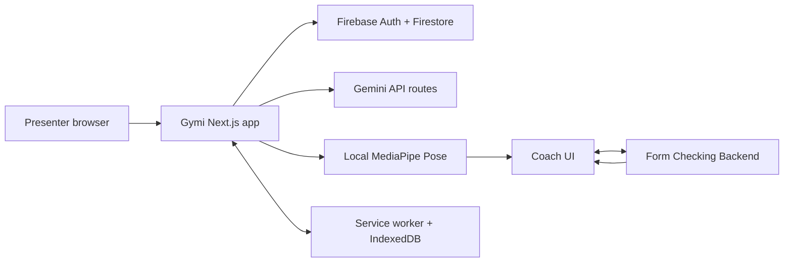
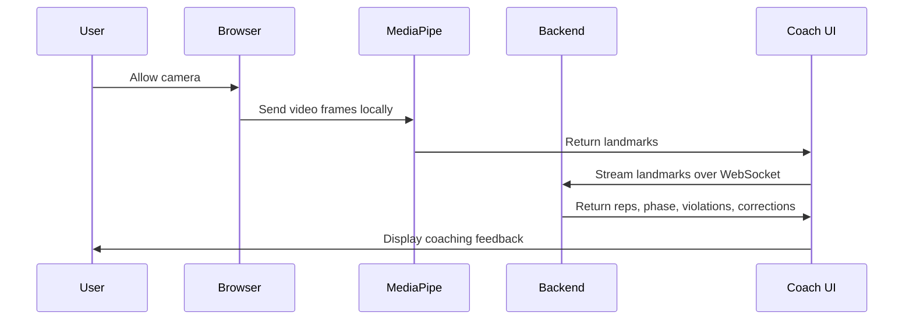

# Exhibition Release Runbook

This runbook is for a reliable Gymi demonstration. It focuses on the workflows that best show the full product: tracking, nutrition, programs, progress, and live form coaching.

## Release Goal

Show Gymi as a working fitness companion:

- Firebase-backed account and personal data.
- Workout, meal, goal, and progress tracking.
- Deterministic workout-program planning.
- Gemini-powered food recognition and coach assistant.
- Real-time pose coaching through the Form Checking Backend.
- PWA/offline behavior for common logging workflows.

## Exhibition Architecture



## Required Services

| Service | Required for | Check |
| --- | --- | --- |
| Gymi frontend | Entire demo | `npm run dev` or deployed app loads. |
| Firebase Auth | Sign-in and protected routes | Test account can sign in. |
| Cloud Firestore | Logs, goals, programs, sessions | Workout or meal can be saved. |
| Gemini API key | Food scanner and coach assistant | `/api/food-recognize/health` reports ready. |
| Form Checking Backend | Live coaching | `/coach` WebSocket connects and returns feedback. |
| Browser camera permission | Live coaching | Camera preview appears on `/coach`. |

## Environment Checklist

Create `.env.local` from `.env.example` and confirm:

```powershell
NEXT_PUBLIC_FIREBASE_API_KEY=...
NEXT_PUBLIC_FIREBASE_AUTH_DOMAIN=...
NEXT_PUBLIC_FIREBASE_PROJECT_ID=...
NEXT_PUBLIC_FIREBASE_STORAGE_BUCKET=...
NEXT_PUBLIC_FIREBASE_MESSAGING_SENDER_ID=...
NEXT_PUBLIC_FIREBASE_APP_ID=...
NEXT_PUBLIC_FORM_COACH_URL=http://localhost:8000
GEMINI_API_KEY=...
GEMINI_MODEL=gemini-2.5-flash
```

For a deployed frontend, `NEXT_PUBLIC_FORM_COACH_URL` must point to the deployed backend URL. For local exhibition setup, keep it as `http://localhost:8000` and run the backend locally.

## Local Demo Startup

Terminal 1:

```powershell
cd D:\work\FYP FINAL\form-checking-backend
uvicorn main:app --reload --host 0.0.0.0 --port 8000
```

Terminal 2:

```powershell
cd D:\work\FYP FINAL\gymi
npm install
npm run dev
```

Open the frontend URL printed by Next.js, usually `http://localhost:3000`.

## Pre-Demo Verification

Run these before the exhibition:

```powershell
cd D:\work\FYP FINAL\gymi
npm test
npm run build
```

Then manually verify:

- Landing page loads.
- Test user can sign in.
- `/home` loads after sign-in.
- A workout can be created.
- A meal can be created.
- Program template activation works.
- `/api/food-recognize/health` reports the scanner is configured.
- `/coach` asks for camera permission, shows the camera, connects to the backend, and displays live feedback.

## Demo Script

### 1. Start With The Dashboard

Show the landing page, sign in, and open `/home`. Explain that Gymi is organized around the user's profile, goals, workouts, meals, programs, and progress.

### 2. Log A Workout

Go to `/workouts`, create a workout, and show it appearing in the list. If a program is active, choose a program session and link the workout to it.

### 3. Show Program Planning

Go to `/programs`, activate a template or generate a plan from the questionnaire. Show that the plan is structured by training days and can be activated, archived, completed, or edited.

### 4. Log Nutrition

Go to `/nutrition`, show daily calorie and macro targets, then add a manual meal or use the food scanner. If scanning, emphasize that the image is processed through the Gymi API route and Gemini returns editable estimates.

### 5. Show Progress

Go to `/progress` and show how logs become charts and summaries. This connects the tracking pages to the user's long-term improvement.

### 6. Run Live Coaching

Go to `/coach`, start a live session, select the camera view if needed, and perform a supported exercise. Show:

- Detected exercise.
- Rep count.
- Phase.
- Valid and invalid reps.
- Corrections and confidence.
- Saved coach session at the end.

### 7. Ask The Coach Assistant

Use the coach assistant panel to ask about the current exercise, recent form, or logged progress. Explain that it receives app context but does not replace medical advice or a certified trainer.

## Live Coaching Flow



## Fallback Plan

| Problem | Fallback |
| --- | --- |
| Backend is cold or unavailable | Show workout, nutrition, programs, progress, and explain the coach page pipeline using the architecture diagram. |
| Camera permission fails | Use another browser profile or reset camera permission in browser settings. |
| Poor pose detection | Improve lighting, keep full body visible, move farther from camera, or switch camera view. |
| Gemini key missing | Use manual meal logging and explain the food scanner health check. |
| Network drops | Show offline logging behavior in workouts or nutrition, then reconnect to demonstrate sync. |
| Firebase test account fails | Keep a pre-signed-in browser session ready and one backup account. |

## Demo Data Suggestions

Prepare a small amount of realistic data before the exhibition:

- 3 to 5 workout logs across different dates.
- 2 meals for today with calories and macros.
- 1 active workout program.
- 1 weight log history with at least 3 points.
- 1 completed coach session if live camera conditions are uncertain.

## Exhibition Notes

- Keep the camera area clear and well lit.
- Do not rely on raw video upload. The current live coach path uses browser landmarks and WebSocket feedback.
- Treat AI food results as estimates and allow editing.
- Keep the backend terminal visible during setup, but hide it during the main product walkthrough.
- Use the diagrams in this docs folder if someone asks how the system is connected.
