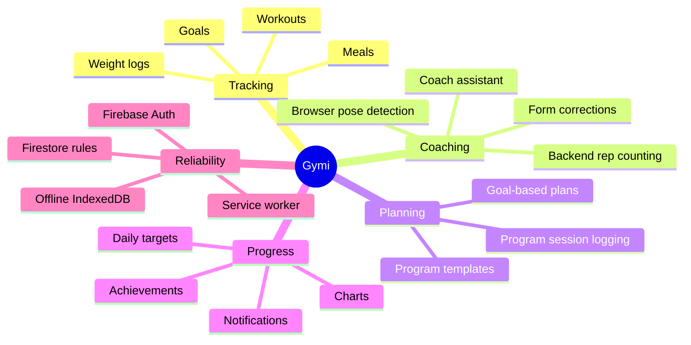
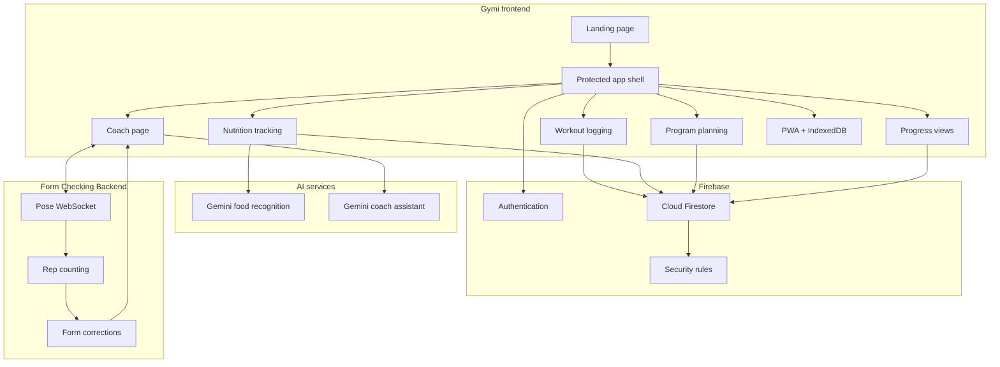
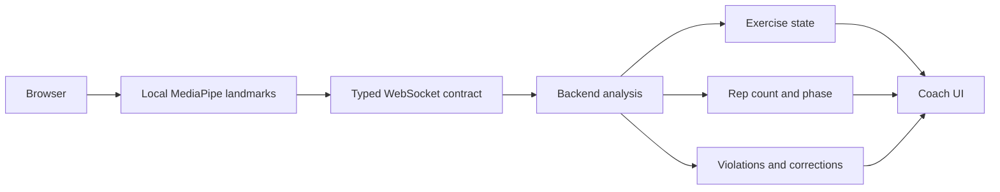
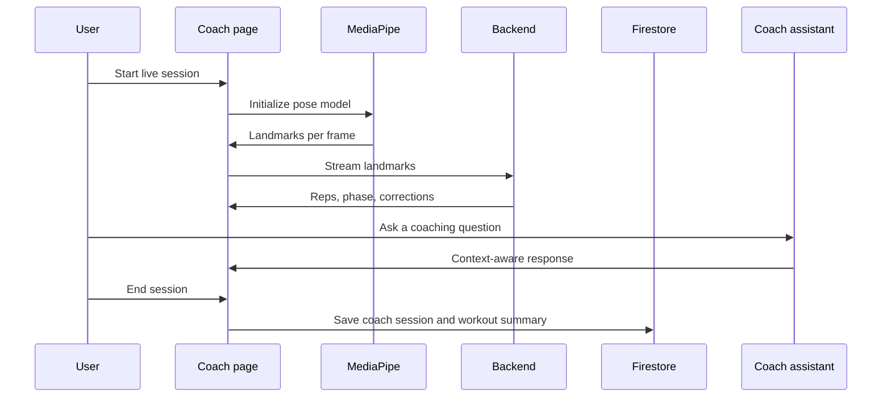
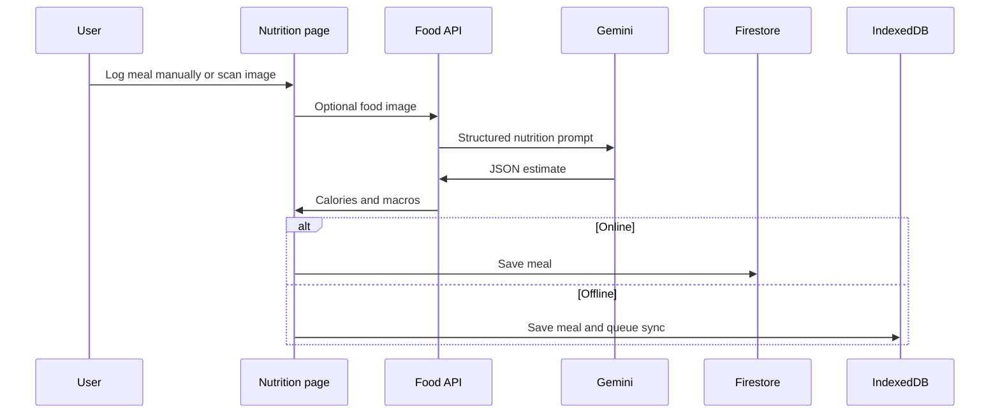
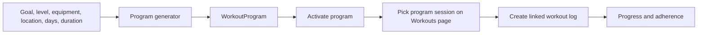

# Gymi Project Overview

Gymi is a fitness companion that combines everyday workout and nutrition tracking with AI-assisted coaching. The frontend is a production-style Next.js PWA, while real-time exercise analysis is delegated to the separate Form Checking Backend.

This document is written for project explanation, exhibition discussion, and technical defense.

## Product Summary

Gymi helps a user answer four practical questions:

- What did I train?
- What did I eat?
- Am I progressing toward my goals?
- Is my form good enough during a coached set?

The product is not just a tracker. It links logs, goals, programs, nutrition, and live coaching into one user-owned profile.

## Current Feature Set

| Area | Current behavior |
| --- | --- |
| Authentication | Firebase Authentication protects the app shell. Logged-out users return to the landing page. |
| Home | Shows profile-aware progress and activity summaries. |
| Workouts | Create, edit, delete, search, filter, and view workout logs. Supports linked program sessions and offline queueing. |
| Nutrition | Manual meal logging, daily calories and macro target cards, meal templates, food scanner, and offline queueing. |
| Programs | Generate deterministic plans from goals, experience, equipment, location, training days, and session length. |
| Coach | Runs MediaPipe in the browser and streams pose landmarks to the Form Checking Backend for live feedback. |
| Coach Assistant | Uses Gemini through `/api/coach-agent` to answer questions with recent app and live-session context. |
| Progress | Visualizes weight, workout volume, goals, and recent activity. |
| Achievements | Tracks user milestones and notifications. |
| Account | Profile, preferences, progress summary, food-scanner health check, and legal links. |
| Offline/PWA | Service worker plus IndexedDB cache key user workflows and replay queued changes when online. |

## Architecture Narrative

The frontend owns user experience and persistence. Firebase owns authentication and per-user data storage. The backend owns real-time biomechanics. Gemini owns selected generative tasks.

## Why The Split Backend Matters

Real-time form checking has different requirements from a dashboard app:

- It needs low-latency streaming.
- It has stateful rep counting and phase detection.
- It can be tested as a separate model and rules pipeline.
- It can scale or deploy independently from the Next.js frontend.

The frontend only sends pose landmarks, camera-view preference, and timestamps. The backend returns interpreted coaching state. That keeps the UI responsive while preserving a clear ownership boundary.

## Main User Journeys

### Coached Workout Journey

### Nutrition Journey

### Program Journey

## Technical Strengths To Explain

- The application uses typed service modules instead of writing Firestore calls directly throughout pages.
- Firestore security rules enforce per-user ownership across the profile and all subcollections.
- Offline behavior is explicit: IndexedDB stores local data and a sync queue rather than pretending the network is always available.
- The coach feature separates browser pose extraction from backend interpretation.
- Gemini usage is constrained behind API routes and returns structured data for app workflows.
- Workout program generation is deterministic, inspectable, and testable.

## Demo Story

The clearest exhibition story is:

1. Sign in and show the home dashboard.
2. Log a workout and show how the same data appears in progress.
3. Generate or activate a program, then link a workout to a program session.
4. Scan or log a meal and show calories/macros updating.
5. Open the coach page, start a live session, and show reps/form feedback from the backend.
6. Ask the coach assistant a question about the current exercise or recent progress.

This story demonstrates the whole system without needing to explain every page first.

## Current Boundaries And Honest Limitations

- The live form coach requires the separate backend service to be running and reachable.
- Camera quality, lighting, body visibility, and angle still affect pose-landmark quality.
- Food recognition is an estimate. The UI should treat results as editable nutrition suggestions, not medical-grade truth.
- Program generation uses deterministic rules and local templates, not a personal trainer or medical expert.
- Firebase Storage is currently locked down. The app should not rely on direct user file uploads to Storage until rules are updated.
- Offline sync is designed for common log workflows, not conflict-heavy multi-device collaboration.

## Suggested Future Improvements

| Priority | Improvement | Why it matters |
| --- | --- | --- |
| High | Add end-to-end tests for the coach connection states. | Protects the highest-risk demo workflow. |
| High | Add explicit program adherence views. | Makes generated plans feel more connected to progress. |
| Medium | Expand exercise templates and substitutions. | Improves usefulness across different equipment setups. |
| Medium | Add richer nutrition history analytics. | Turns food logging into progress insight. |
| Medium | Add clearer offline sync status per item. | Builds user trust when network quality is poor. |
| Low | Add Firebase Storage support for future media features. | Useful only after storage rules and privacy behavior are designed. |

## Defense Talking Points

- Gymi is intentionally modular: frontend, Firebase, Gemini, and form-checking backend have separate responsibilities.
- The architecture avoids sending raw video to the backend; the browser sends pose landmarks instead.
- The app can still support normal logging flows when the AI services are unavailable.
- The program generator is deterministic so it can be validated and debugged.
- The codebase already has a test suite and explicit verification commands, which supports maintainability beyond a prototype.
