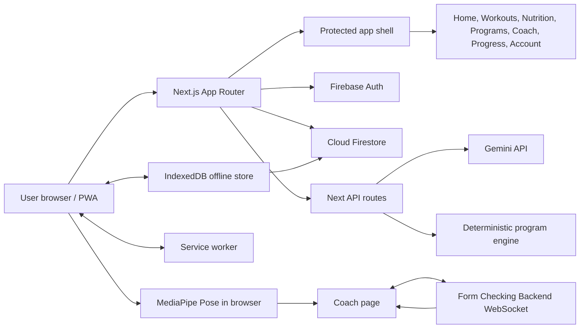
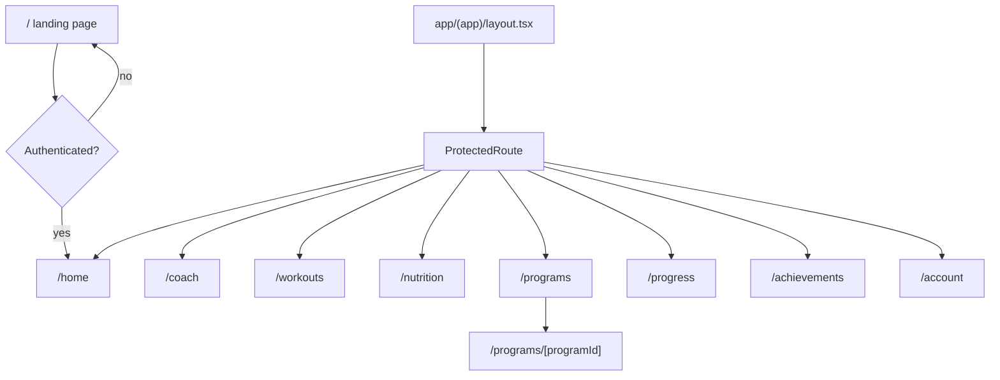
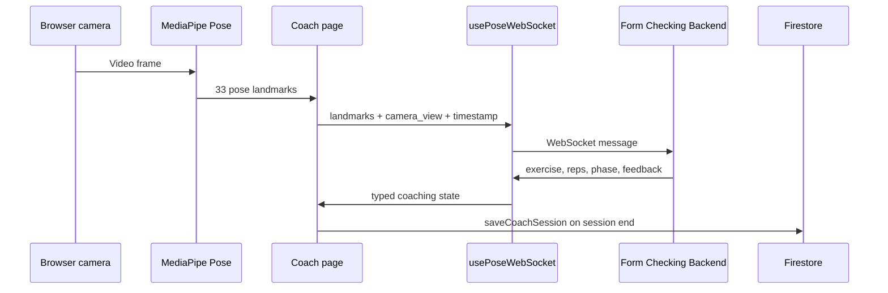
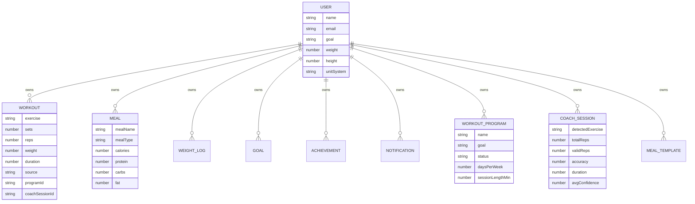
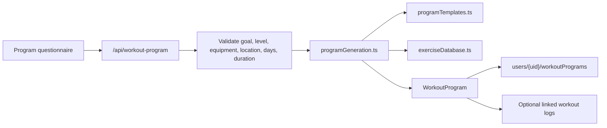
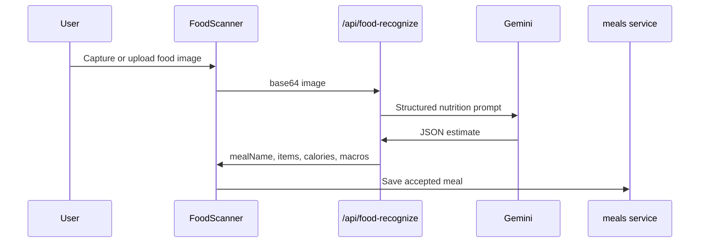
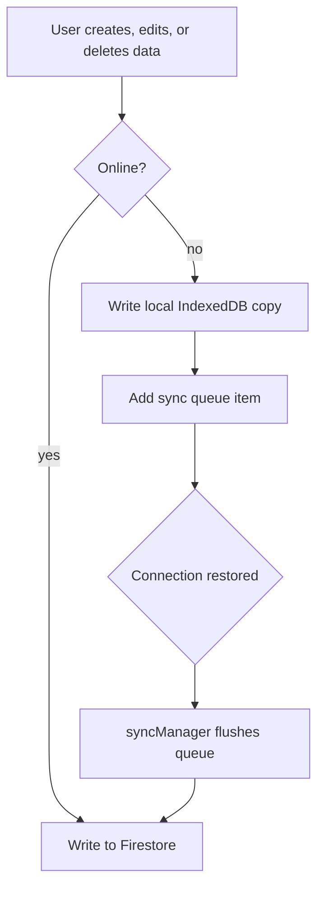

# Gymi Documentation

This folder documents the current Gymi frontend codebase. Gymi is a Next.js PWA for workout logging, nutrition tracking, AI-assisted food recognition, program planning, and real-time exercise form coaching through the separate Form Checking Backend.

Use this folder with the root [README.md](../README.md). The root file is the quick start; this folder is the deeper system reference.

## Documentation Map

| File | Purpose |
| --- | --- |
| [README.md](./README.md) | Current technical architecture, data flows, setup, and integration notes. |
| [Project.md](./Project.md) | Product and demo narrative for explaining what Gymi does and why the architecture matters. |
| [EXHIBITION_RELEASE.md](./EXHIBITION_RELEASE.md) | Exhibition-day runbook, demo checklist, and fallback plan. |
| [DEV_PLAN.md](./DEV_PLAN.md) | Living development plan, shipped status, roadmap, and verification commands. |

## Current System

Gymi is built with:

- Next.js 16 App Router and React 19.
- Firebase Authentication and Cloud Firestore.
- IndexedDB plus a service worker for offline-friendly workout, nutrition, goal, and weight-log workflows.
- MediaPipe Pose Landmarker running in the browser.
- A WebSocket connection to the Form Checking Backend for exercise classification, rep counting, phase detection, and correction feedback.
- Gemini API routes for food image recognition and the coach assistant.
- Deterministic local program generation from structured templates and an exercise database.



## Application Routes

The public landing page lives at `/`. Authenticated app routes are grouped under `app/(app)` and protected by `ProtectedRoute`.



## API Routes

| Route | Method | Purpose |
| --- | --- | --- |
| `/api/coach-agent` | `POST` | Generates coach-assistant responses from live exercise context, recent sessions, workouts, meals, and goals. |
| `/api/food-recognize` | `POST` | Accepts a base64 JPEG, PNG, or WebP image and returns structured nutrition estimates from Gemini. |
| `/api/food-recognize/health` | `GET` | Checks Gemini key/model readiness for the food scanner. |
| `/api/workout-program` | `POST` | Generates a structured workout program from questionnaire input using the local program engine. |
| `/api/workout-program/generate` | `POST` | Compatibility route that delegates to `/api/workout-program`. |

## Form Coach Integration

The `/coach` page uses a browser-first pipeline:

1. The browser loads the MediaPipe WASM files from `/mediapipe/wasm`.
2. The pose model is loaded from `/models/pose_landmarker_lite.task` unless overridden by `NEXT_PUBLIC_MEDIAPIPE_MODEL_PATH`.
3. The page extracts 33 pose landmarks locally.
4. Landmarks are sent to the backend WebSocket from `usePoseWebSocket`.
5. The backend returns exercise state, reps, phase, violations, corrections, confidence, and camera-view feedback.
6. Completed sessions are saved as `coachSessions` and mirrored into workout history.



The frontend configuration is centralized in [lib/config.ts](../lib/config.ts):

- `NEXT_PUBLIC_API_BASE_URL`
- `NEXT_PUBLIC_FORM_COACH_URL`
- `NEXT_PUBLIC_MEDIAPIPE_MODEL_PATH`
- `NEXT_PUBLIC_MEDIAPIPE_WASM_PATH`

If no backend URL is provided, the frontend defaults to `http://localhost:8000` for local development and derives the matching WebSocket URL automatically.

## Firebase Data Model

All user-owned data is stored below `/users/{uid}`. Firestore rules allow a signed-in user to read and write only their own document and subcollections.



Main collection helpers live in:

- [lib/workouts.ts](../lib/workouts.ts)
- [lib/meals.ts](../lib/meals.ts)
- [lib/goals.ts](../lib/goals.ts)
- [lib/weightLogs.ts](../lib/weightLogs.ts)
- [lib/workoutPrograms.ts](../lib/workoutPrograms.ts)
- [lib/coachSessions.ts](../lib/coachSessions.ts)
- [lib/notifications.ts](../lib/notifications.ts)

## Programs

Workout programs are generated in the frontend/API project without an LLM. The generator validates the questionnaire, selects exercises from the local exercise database, applies goal and experience rules, and returns a typed program plan.



The Programs page supports template activation, active-program management, archive/complete/delete actions, inline day edits, and optional program-session logging from the Workouts page.

## Nutrition And Food Recognition

The Nutrition page works with manual meal logging, offline IndexedDB storage, daily macro target cards, meal templates, and Gemini-powered food scanning.



The API route enforces image type and size limits, strips data URI prefixes, requests structured JSON, and reports explicit configuration, quota, rate-limit, and malformed-response errors.

## Offline And PWA Behavior

Gymi registers [public/sw.js](../public/sw.js), caches app routes and static assets, and keeps a local queue in IndexedDB for offline mutations.



IndexedDB currently stores workouts, meals, goals, weight logs, and a sync queue. Workouts and nutrition pages read from Firestore when online and fall back to local data when offline.

## Environment Variables

Create `.env.local` from [.env.example](../.env.example).

| Variable | Required | Purpose |
| --- | --- | --- |
| `NEXT_PUBLIC_FIREBASE_API_KEY` | Yes | Firebase web app key. |
| `NEXT_PUBLIC_FIREBASE_AUTH_DOMAIN` | Yes | Firebase Auth domain. |
| `NEXT_PUBLIC_FIREBASE_PROJECT_ID` | Yes | Firebase project id. |
| `NEXT_PUBLIC_FIREBASE_STORAGE_BUCKET` | Yes | Firebase storage bucket. |
| `NEXT_PUBLIC_FIREBASE_MESSAGING_SENDER_ID` | Yes | Firebase sender id. |
| `NEXT_PUBLIC_FIREBASE_APP_ID` | Yes | Firebase app id. |
| `NEXT_PUBLIC_FORM_COACH_URL` | Recommended | HTTP URL for the Form Checking Backend. |
| `NEXT_PUBLIC_API_BASE_URL` | Optional | Alternate backend URL name supported by the config module. |
| `NEXT_PUBLIC_MEDIAPIPE_MODEL_PATH` | Optional | Override for pose landmarker model path. |
| `NEXT_PUBLIC_MEDIAPIPE_WASM_PATH` | Optional | Override for MediaPipe WASM path. |
| `GEMINI_API_KEY` | Needed for AI features | Enables food recognition and coach-agent responses. |
| `GEMINI_MODEL` | Optional | Overrides the default Gemini model. |

## Local Development

From the `gymi` repository:

```powershell
npm install
npm run dev
```

Run the form-checking backend separately if you want live coaching:

```powershell
cd ..\form-checking-backend
uvicorn main:app --reload --host 0.0.0.0 --port 8000
```

Useful frontend commands:

```powershell
npm run lint
npm test
npm run build
npm start
```

## Verification Checklist

Before considering the docs and app state current:

- `npm test` passes.
- `npm run build` succeeds before production deployment.
- Firebase environment variables are present.
- `NEXT_PUBLIC_FORM_COACH_URL` points to the correct backend for the target environment.
- `/api/food-recognize/health` returns ready when Gemini features are part of the demo.
- `/coach` connects to the backend WebSocket and receives live feedback.
- Firestore rules are deployed for the matching Firebase project.

## Known Boundaries

- Storage uploads are intentionally blocked by the current Firebase Storage rules. Food scanning uses client-provided image data through an API route, not Firebase Storage.
- Program generation is deterministic and template-based. This is intentional for predictable plans and easier testing.
- The coach pipeline depends on a separate backend service. Gymi owns camera capture, MediaPipe landmark extraction, WebSocket transport, and UI persistence; the backend owns classification, rep counting, phase detection, and corrections.
- The service worker caches selected routes and assets. It is not a replacement for Firestore security rules or server-side validation.
